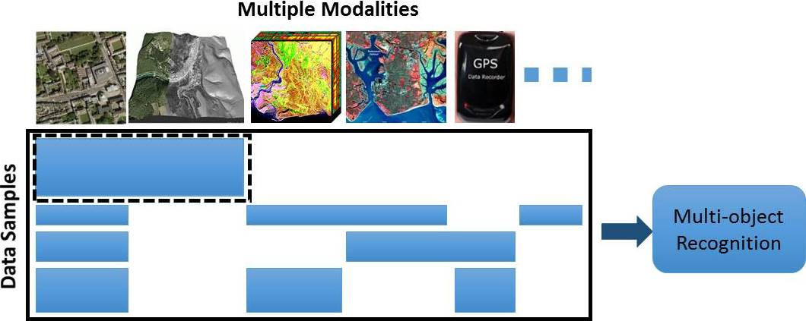

# Missing Modalities Imputation via Cascaded Residual Autoencoder (CRA)
### [[Project page]](http://cvlab.cse.msu.edu/project-fuse-missing-modalities.html)   [[CVPR'17 Paper]](http://cvlab.cse.msu.edu/pdfs/Tran_Liu_Zhou_Jin_CVPR2017.pdf)




## Library requirements

* Caffe
* (Matlab)


## Data

Please create HDF5 files (see hdf4creation folder) with tags modal1, modal2, ... 

## Run the code

This is a part of our source code use for Multi-PIE experiment written in Caffe.
The code is for a instance when the CRA is consisting of 3 RAs. Modification with different numbers of RA is straight-forward

Pretraining

```bash
pretrain3_CRA.sh
```


Finetunning

```bash
ft_CRA.sh
```


## Citation

If you find this work useful, please cite our papers with the following bibtex:
```latex
@inproceedings{ tran2017missing,
  author = { Luan Tran and Xiaoming Liu and Jiayu Zhou and Rong Jin },
  title = { Missing Modalities Imputation via Cascaded Residual Autoencoder },
  booktitle = { In Proceeding of IEEE Computer Vision and Pattern Recognition },
  address = { Honolulu, HI },
  month = { July },
  year = { 2017 },
}
```

## Contacts

If you have any questions, feel free to drop an email to _tranluan@msu.edu_.


